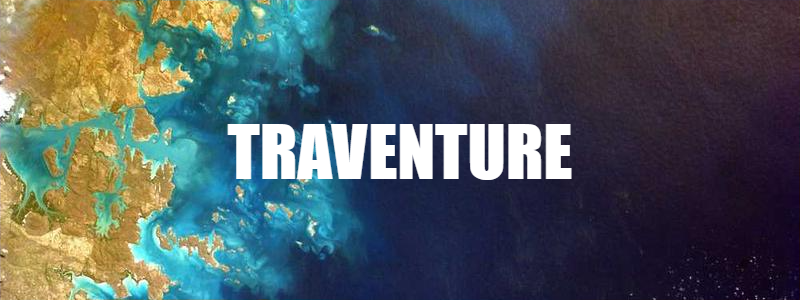

## Overview

This travel app allows the user to add travel locations with an image, url, location, tags and more to a board. A pop form allows the user to input this information.

This was my first time using Routes in React in order to display different pages.

I used DataStax (https://www.datastax.com/) for creating the database.

## Technologies Used

## Approach Taken

For the posts, I created a Card component to display all the information for each post.

After fetching the data:

Each post was then mapped to the dashboard.

## Wins and Challenges

### Wins

Using components in React was actually very comfortable to me and made sense. Importing and Exporting between components felt fairly nartural.

### Challenges

It was a new experience to use the Document API on DataStax for storing and fetching JSON data. It was also my first time writting a JSON file for the default posts for this app.
Also, I ended up having an issue that took me a while to figure out until I finally found that it was a simple misspelled word. It was a good lesson to not rush through, but instead to be more careful in checking my work.

Creating the server side was a new experience for me as well.

## Map API

The API used was from MapBox (https://www.mapbox.com/)
